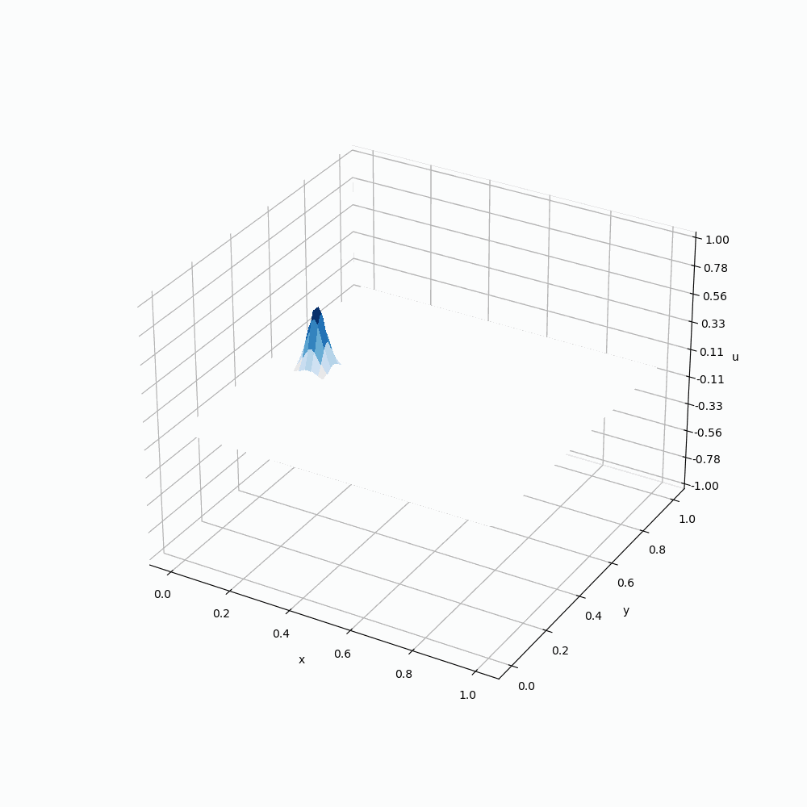
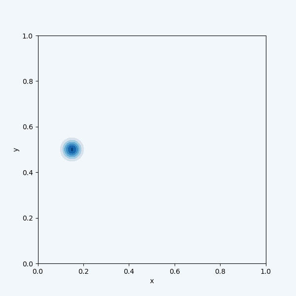
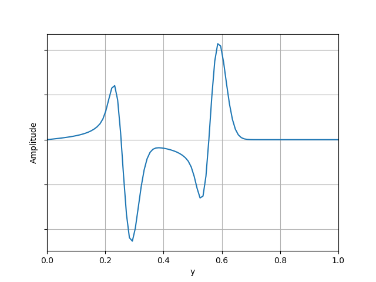

# 2D Acoustic Wave Propagation in a Confined Space

This project models acoustic wave propagation in a 2D room by solving the 
2D wave equation using an explicit finite difference scheme with central 
differences in both space and time.
The results capture wave reflection off rigid walls and highlight phenomena 
such as constructive and destructive interference.

The full project description, derivations, and analysis are available in the report:  
[Full Project Report (PDF)](./ME2_Computing_Coursework.pdf)

Credits: Maria Gimeno Freixas, Gian Andrea Rossi — produced for the second year Computing module at Imperial College London, Department of Mechanical Engineering. 

---

## Visualisations

### 3D Wave surface evolution

### Contour evolution

### Example wave profile along midplane

